# Ribble Valley Soap Co.

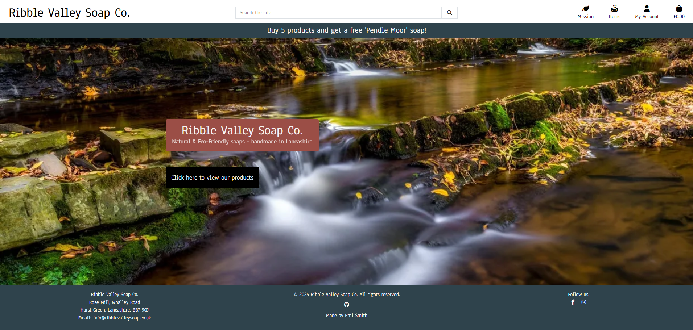

## Table of Contents

- [Introduction](#introduction)
- [Design](#design)
- [Features](#features)
- [User Stories](#user-stories)
- [Languages](#languages)
- [Database](#database)
- [Agile Design Principles](#agile-design-principles)
- [Testing](#testing)
- [Bugs](#bugs)
- [Deployment](#deployment)
- [Credits](#credits)

## Introduction

Ribble Valley Soap Co. is a fictional e-commerce shop that sells handmade soap and shampoo bars inspired by the area in which I grew up in. I wanted to build a site which was modern with clean aesthetics, while portraying the natural environment of the Ribble Valley. The site incorporates many aspects of modern-day e-commerce sites such as creating, editing and deleting a user profile. The site demonstrates what its purpose is on the landing page and the user is in no doubt at what the site is. Throughout the site a series of messages inform the user of changes and events that have occurred so they are aware. There is scope for the business owner to create more products if they so desire and to add to the database without having to use an admin panel. This front-end functionality ensures that users who are not particularly tech competent can update their product database.

## Design

As mentioned above, I wanted to create a modern, clean and sleek looking site that has its roots in nature using high quality images of the locality to highlight this. The colour scheme and font were chosen to represent modern elegance with warm undertones. I wanted a site that was intuitive and which flows naturally, purposeful buttons are used throughout the site to direct users without the need of using back, forward or refresh buttons in the browser.

### Color Scheme

I found a color scheme that fitted my theme from [coolors.com](https://coolors.co/dcd6d1-b38656-2f434c-f7f5f3-9b4e46). 

Lion (#B38656): A warm, rich amber hue that adds a touch of earthiness and warmth to the design. I used this sparingly for the links in the bundles page to add some warmth to the page and also as the loading screen upon checkout.

Charcoal (#2F434C): A deep, muted blue-gray that grounds the design with a sense of depth and sophistication. This was utilised throughout the site and contrasts well with the White Smoke colour, it makes for easy reading too.

White Smoke (#F7F5F3): A soft, off-white shade that creates a light and airy feel throughout the design. This color is used for backgrounds and subtle accents, ensuring content readability while maintaining a clean, open atmosphere.

Redwood (#9B4E46): A bold, deep coral that injects a touch of vibrancy into the palette. Used sparingly for call-to-action buttons and important highlights, it adds a modern flair and draws attention to critical interactive elements.

### Font

My font was chosen from [googlefonts](https://fonts.google.com/specimen/Anaheim?query=anaheim) - The typography of the website is built around the Anaheim font, which combines a clean, modern, and professional aesthetic with a touch of elegance.

### Wireframes

I used the [Frame0](https://frame0.app/) wireframing tool to design simple mock-ups of my site to give me an initial idea of how the site layout should be.

This wireframing tool was useful for me to get a sense of how I initially wanted the site to look. However, as the projects developed ideas and restraints meant that change were neccessary. For example, on my Mission page, as I was coding, I realised that this page was informative but lack any form of user interaction. Therefore to boost user engagement I decided to include a carousel of images and a button back to the products page. This is not reflected in the initial wireframes though.

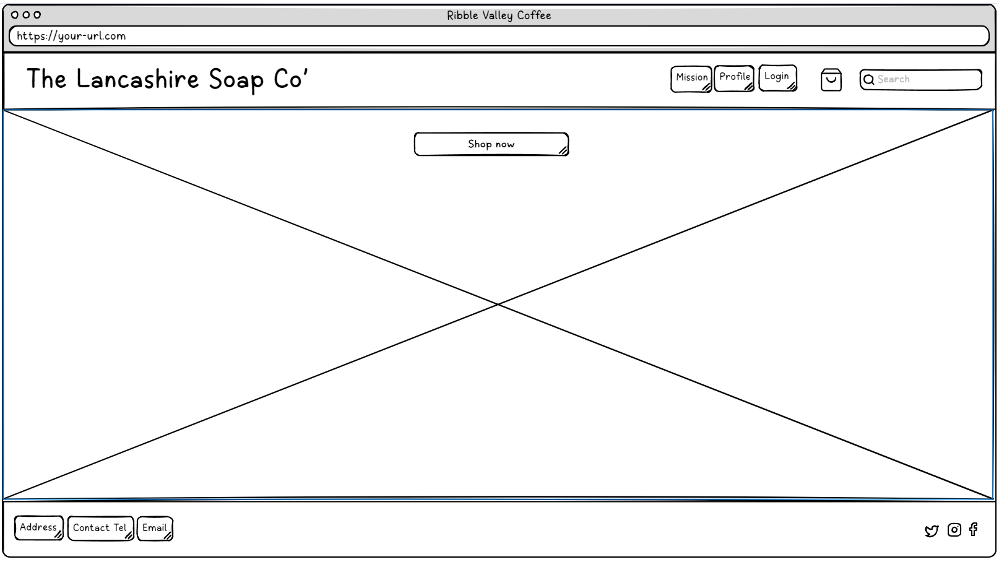
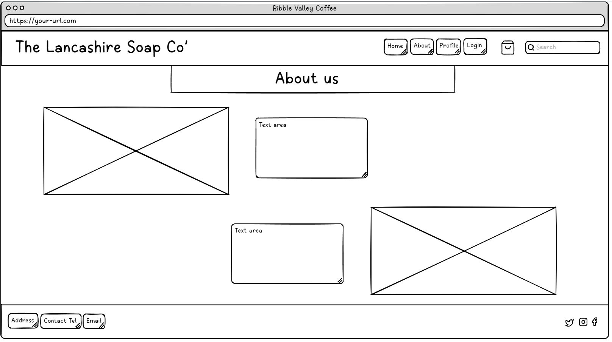
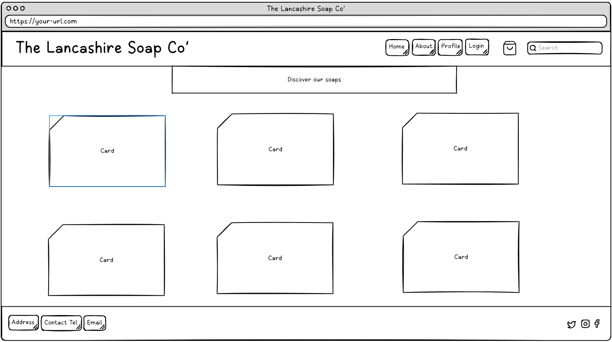
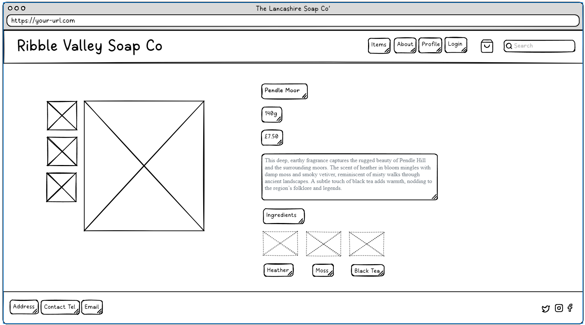
## Features

### Site Pages

The following examples are screenshots of the various pages on my site.

### Home page

This is where the user first sees the site. All pages on the site consist of a navbar, the main content and a footer. On the home page the title of the company is displayed in the navbar along with a search bar function, a mission page, my account details and a bag icon.

Underneath the navbar is an offer banner that displays on some but not all pages of the site. It informs the user of an offer that they could be eligible for.

In the main section, there is a hero image of a river and over the top is the company name and a tagline informing the user of what the company sells. Underneath this tagline is a link straight to the products page.

At the bottom of the page is a footer, which includes information on the company address, my github details and a link to Facebook and Instagram.


### Mission Page

This page informs the user about the company. It aims to tell the user about the practices that the business uses and uses high quality and appealing images to draw the users in. The Mission page uses an image carousel displaying handmade soaps, promotes being eco-friendly and how it involves the local community.

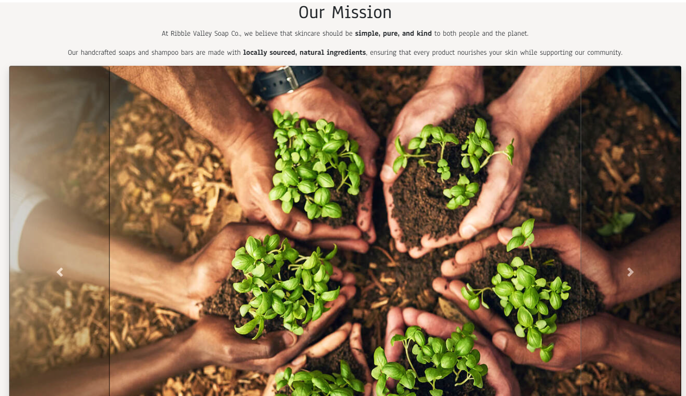

### Products Page

This page is accessed by following the link on the landing page. It can also be accessed by logged in users straight from the navbar. This products page displays all products that the site sells, along with searching by name and cost and also by filtering through different categories.

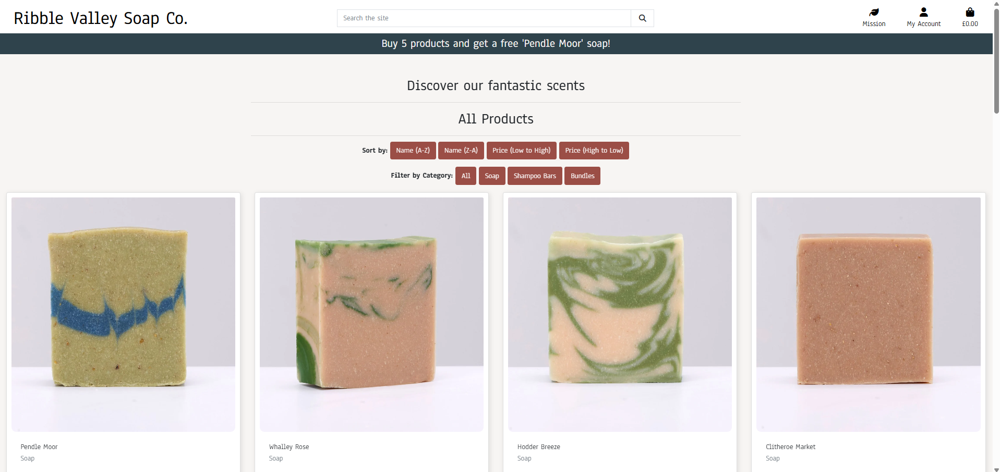
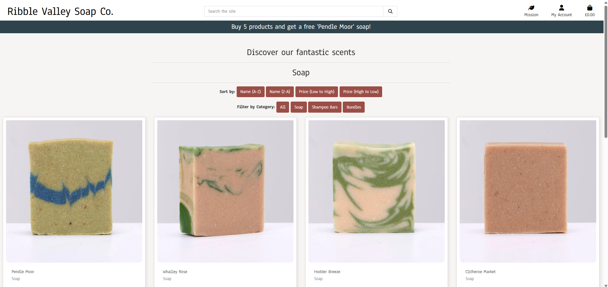
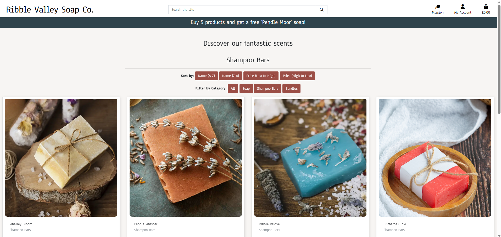
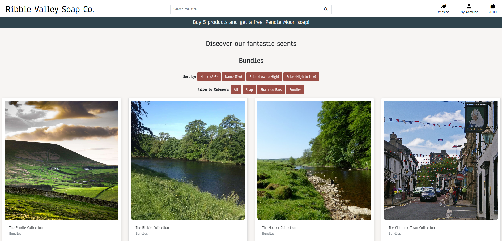


This page also includes a 'back to top' button to allow the user to return to the filtering and searching options quickly and effectively.

### Product Page

#### Soaps & Shampoo Bars

The individual product page is dynamic and will change dependent on which product was chosen. I have three categories of products, soaps, shampoo bars and bundles. For the soap and shampoo bars the same product detail page is used. Each product has an image, price, weight, the displayed category, a description, dynamic ingredients and the ability to add these to the bag. Also there is a product gallery feature that the business owner could utilise with more images of the product, where a user clicks on an image and it becomes the main image.


#### Bundles
For the bundles, the product detail page is different as these consist of a soap and a shampoo bar. The bundles still have a price, weight, description but they also include links to the included items. As the bundles contains multiple items, there is no ingredients section.

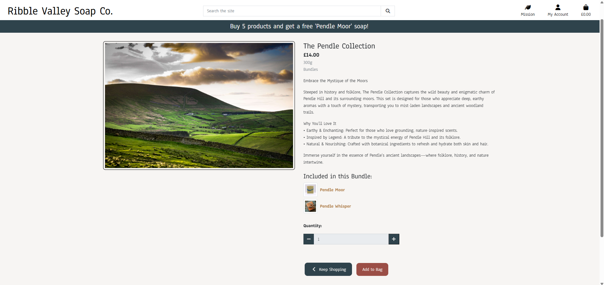

#### Add to bag button
The add to bag button at the bottom of the product page allows users to choose an item and place it it their bag. A user may use the add and minus buttons to increase the number of product they want to purchase. The user is not allowed to manually input a number so they cannot choose a negative number. The max items allowed is 99. When successful at placing an item in the bag a success message is displayed underneath the navbar in the top right hand corner. This toast button includes a link to view the bag. This message disappears after 5 seconds.

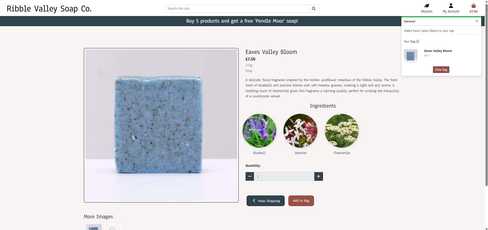

#### Logic for offer

The offer stated on numerous places informs the user that if they buy 5 products, they will receive a free 'Pendle Moor' soap.


The logic for this is handled on the bag page. If there is a total of 5 items in the bag then a Pendle Moor soap will be added along with a success message.
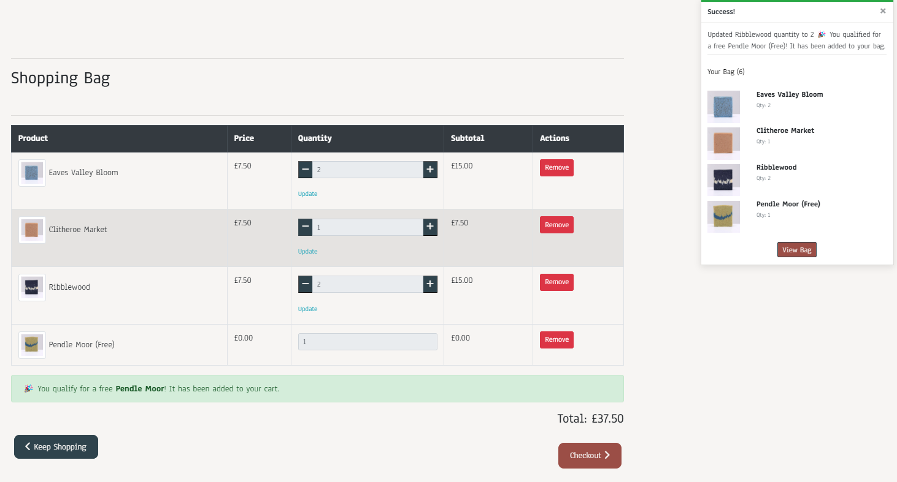

The free product appears in the bag table and a user is not able to interact with it, they cannot add more items in or input a number in the quantity selector. They can remove it if they so wish though. If the total number of items falls below 5 then the free soap is taken out of the bag and a message informing the user of this is displayed.

### Bag

This page allows the user to look at, update and delete any product that they have previously selected and put in their bag. The bag is in the form of a clear table, the quantity of the item can be increased or decreased using the quantity selector buttons and updated and is reflected in the price.

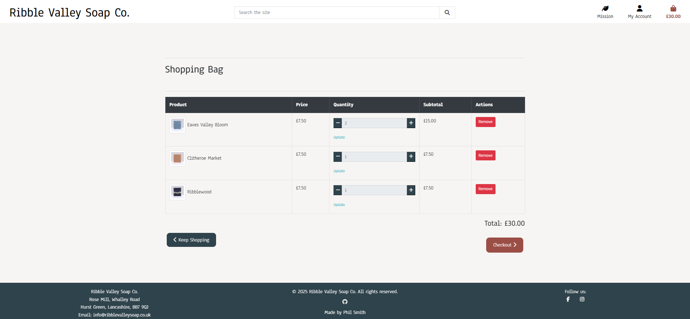

The user can remove an item completely from the bag by clicking the remove button. 

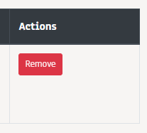

### Checkout

The checkout screen includes a summary of what the user has in their bag. This provides further clarity in what the user buys and lessens the chance they purchase something they did not want. Personal details and delivery details are required at this point so the site can deliver the products.

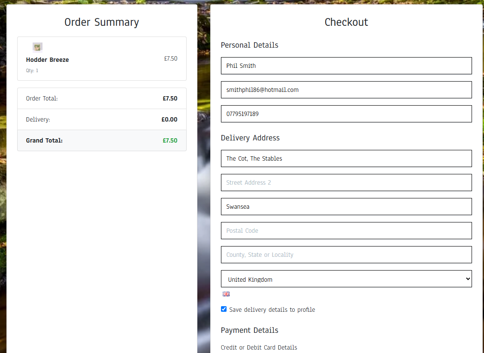

Once the form is valid, a user is able to input their debit or credit card details. Validation is again required as the card details need to be correct or the form will not be accepted and the user is unable to proceed further.

### Checkout Success

Upon the completion of the payment, the user is redirected to an order summary page, where all the details of the purchase are. This is designed to ensure that the customer can check to see if they have ordered the correct items. A unique number is issued to the user and through this number the order can be tracked by the owner of the site. The user is able to use the link to go back to the products page.


### My Account

In this section the user is able to update their profile and this is used in the delivery section of the checkout page. If any of their details change such as their address, they can update it in their profile and this will be saved and used when they next purchase a product. In this section, there is the ability for a user to delete their account. This button takes the user to a prompt warning them that the decision is permanent.

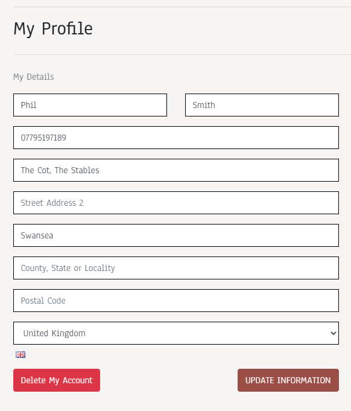

Along with the profile, there is an order history list. Any previous orders can be looked at using the link on the order number. Clicking on an order number, prompts a toast to display an alert informing the user that this is a past order.

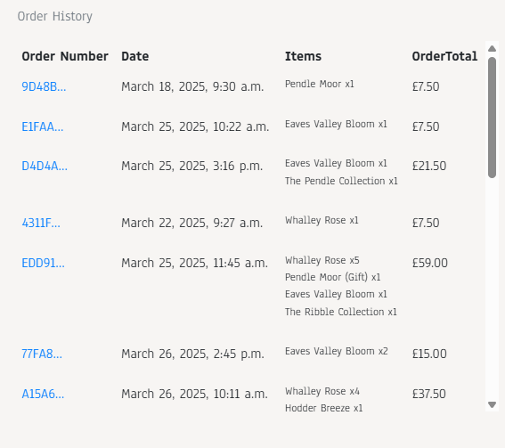

### Business Owner CRUD functionality

As the business owner, it is important to regularly update their database to add new products and update existing ones to keep the business fresh and exciting. Therefore there is the add and edit product pages on the front-end that are user friendly. A new product can be added to the store and it is stored in the database and ready to be used quickly and efficiently.

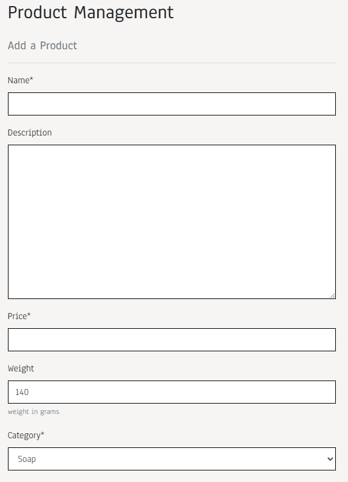
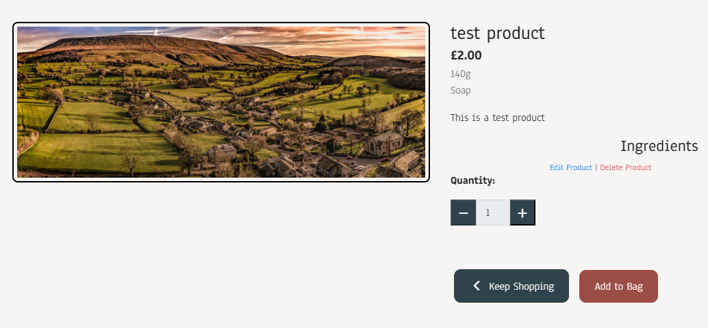

This or any product can be edited by the owner. This is useful for the owner if they needed to run a sale or make quick changes in face of user demands.

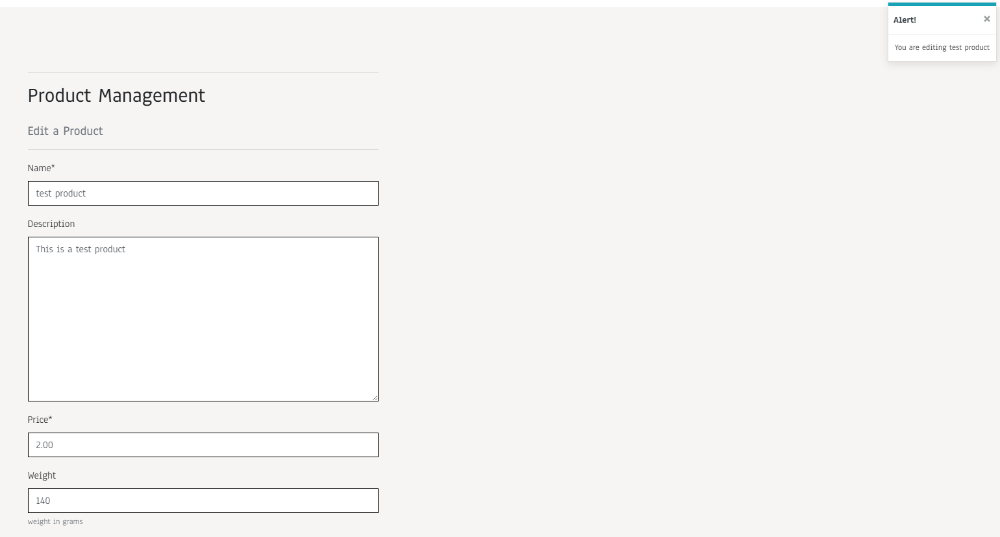

Lastly, the owner would need to have the ability to delete a product from their site for a  number of reasons, such as they have run out of stock or being unable to produce the item anymore. Therefore it is important that the owner can delete a product quickly.

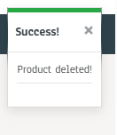

### Custom Error pages

Considering feedback from my last project, I wanted to ensure that the user is never directed to pages that are unstyled and not part of my domain, therefore I have set up custom 404 and 500 error pages to trigger if these events occur.

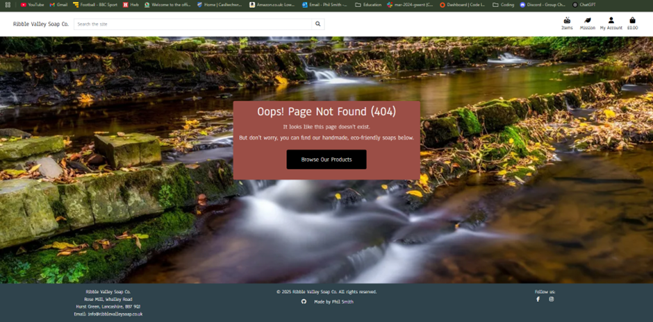
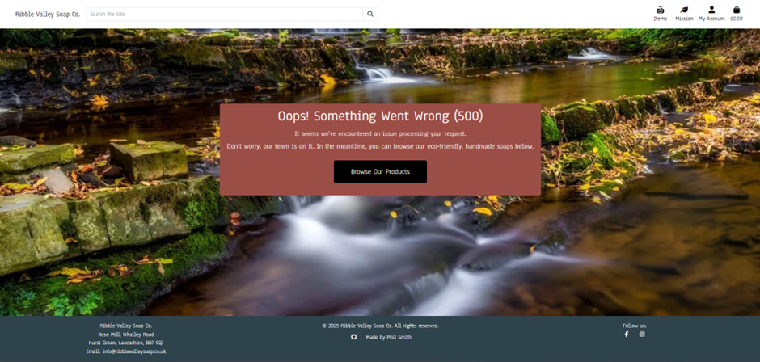

### Future features

If this website was to be developed further, a number of features could be brought in. For example, a review system could be implemented where users can leave feedback in the form of comments or a number rating on certain products. Users can find out more information about products or leave suggestions in the form of a owner message - which goes straight to the business owner. A frequently asked questions section could be developed.

## User Stories

All of the user stories can be located in the liked GitHub project [here](https://github.com/users/smithphil88/projects/4).

## Languages

Technologies used:

- [HTML](https://en.wikipedia.org/wiki/HTML) used for the main site content.
- [CSS](https://en.wikipedia.org/wiki/CSS) used for the main site design and layout.
- [JS](https://en.wikipedia.org/wiki/JavaScript) used to develop user-friendly, interactive functions.
- [Python](https://www.python.org) used as the back-end programming language.
- [Git](https://git-scm.com) used for version control. (`git add`, `git commit`, `git push`)
- [GitHub](https://github.com) used for secure online code storage.
- [Gitpod](https://gitpod.io) used as a cloud-based IDE for development.
- [Bootstrap](https://getbootstrap.com) used as the front-end CSS framework for modern responsiveness and pre-built components.
- [Django](https://www.djangoproject.com) used as the Python framework for the site.
- [PostgreSQL](https://www.postgresql.org) used as the relational database management.
- [Heroku](https://www.heroku.com) used for hosting the deployed site.
- [Gunicorn](https://gunicorn.org/) used for WSGI server.
- [Frame0](https://frame0.app/) used to design mock-up pages.
- [Allauth](https://docs.allauth.org/en/latest/) used as the user authentication system.
- [Stripe](https://stripe.com) used for online secure payments of ecommerce products/services.
- [Cloudinary](https://cloudinary.com/) used to host my static files and images for the deployed app.
- [Lucidchart](https://www.lucidchart.com/pages) was utilised to create my relational databases.
- [Responsive viewer](https://responsiveviewer.org/) was used to test multiple devices for responsivity.
- [DevTools](https://en.wikipedia.org/wiki/Web_development_tools) were used extensively to debug, check, problem-solve and for responsive purposes.

## Bugs 

I encountered many issues during development. The majority of these were encountered as I had coded incorrectly and with efficient use of [Google](https://www.google.com) I was often able to solve these independently and relatively quickly. I used the [Slack](https://slack.com/signin#/signin) workspace to search for similar issues and problems from other students which helped in many circumstances. I utilised [Stack Overflow](https://stackoverflow.com/) often to debug problems and generally look for advice and guidance. Alongside these two forums, I extensively used 
[W3 Schools](https://www.w3schools.com/) and [Django Documentation](https://docs.djangoproject.com/en/5.1/). I used these to try to follow best practices where possible. I had many problems to solve during the project but the majority of these were simple to fix when the root of the issue was found. However, I did have two bugs that took significant resources to find and fix.


This appeared after I had first deployed my project to Heroku. My project was successfully working with functionality throughout in my local environment. I was in the process of moving all to a deployed site (in hindsight I should have deployed straight away to avoid issues such as this). As my site was extensive at this point, it proved troublesome to locate what was happening in order to find the cause of the bug. I read about how to use python's shell, Heroku logs and more console commands and I installed the Heroku CLI. The bug was caused by a combination of not migrating correctly and the Stripe module being missing in my Heroku environment. 


My second major bug appeared towards the end of the project and as a result my (in my opinion) extensive project meant it was hard to locate. At this point I was tidying up my code to make sure it was 100% in line with PEP8 and I was generally doing housekeeping on all areas of my code. On reflection, I was not being logical about this process and a mixture of fatigue, time-pressure and illness led to the javascript loading spinner to appear on my checkout screen before checkout was complete. I went through the Boutique Ado walkthrough, to the part where this was implemented and my code looked the same. I checked Heroku in the commits I had done and what changes I had made, searching for any changes to the checkout.html, views, models, forms, webhooks etc. But I was unable to find it. However, I did eventually, as I was tidying up my code, I wanted to get rid of lines that were empty or seemingly did nothing. At that point I removed the block extra css - this small removal caused a lot of issues! However, it was a useful lesson for my development and since then I have been more careful and more descriptive about my commit messages and not making so many changes at a given time.

## Database

I designed my database using [Lucidchart](https://www.lucidchart.com/pages). I created my Entity Relationship Diagram (ERD) to visualise the relationship between my database models.

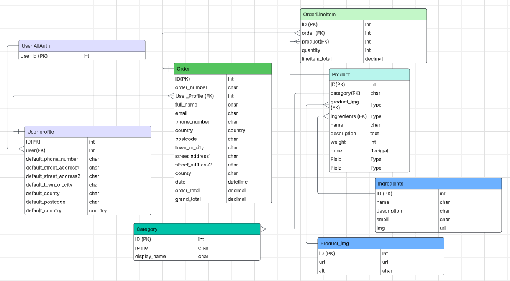

### Custom Models

From creating my ERD, I developed my custom models. I wanted my product model to be unique and it has different relationships with other models. It has a one-to-many relationship with the Product gallery - where a product can have many images in the gallery but these Product images only belong to that product. It has a many-to-many relationship with ingredients, where a product can have many ingredients and these ingredients can also be used with other products. I also created the functionality for the bundle to have a many-to-many relationship where a bundle include many products and these products could be a part of a different bundle if the owner so wishes. 

From this project, I do feel my understanding of relationships between models has greatly improved from the previous project.

## Agile design principles

### Github Projects

[Github Projects](https://github.com/smithphil88/soap_co/projects?query=is%3Aopen) was utilised as an Agile design tool throughout this project. Using the right tags, issues and assignments, it served to promote efficient and effective Agile design principles.

### Github Issues

[Github Issues](https://github.com/smithphil88/soap_co/issues) was used alongside Github Projects. This was how I created my user stories, using a custom template that served my purposes.

## Testing

For all testing, please refer to the [TESTING.md](TESTING.md) file.

## Deployment

The live deployed application can be found deployed on [Heroku]().

### Heroku Deployment

This project uses [Heroku](https://www.heroku.com), a platform as a service (PaaS) that enables developers to build, run, and operate applications entirely in the cloud.

Deployment steps are as follows, after account setup:

- Select **New** in the top-right corner of your Heroku Dashboard, and select **Create new app** from the drop-down menu.
- Your app name must be unique, and then choose a region closest to you (EU or USA) and finally, select **Create App**.
- From the new app **Settings**, click **Reveal Config Vars** and set your environment variables.

| Key | Value |
| --- | --- |
| `DATABASE_URL` | user's own value |
| `DISABLE_COLLECTSTATIC` | 1 (*this is temporary, and can be removed for the final deployment*) |
| `SECRET_KEY` | user's own value |

Heroku needs two additional files in order to deploy properly.
- requirements.txt
- Procfile

You can install this project's **requirements** (where applicable) using:
- `pip3 install -r requirements.txt`

If you have your own packages that have been installed, then the requirements file needs to be updated using:
- `pip3 freeze --local > requirements.txt`

The **Procfile** can be created with the following command:
- `echo web: gunicorn app_name.wsgi > Procfile`
- *replace **app_name** with the name of your primary Django app name; the folder where settings.py is located*

For Heroku deployment, follow these steps to connect your own GitHub repository to the newly created app:

Either:
- Select **Automatic Deployment** from the Heroku app.

Or:
- In the Terminal/CLI, connect to Heroku using this command: `heroku login -i`
- Set the remote for Heroku: `heroku git:remote -a app_name` (replace *app_name* with your app name)
- After performing the standard Git `add`, `commit`, and `push` to GitHub, you can now type:
    - `git push heroku main`

The project should now be connected and deployed to Heroku!

### Local Deployment

This project can be cloned or forked in order to make a local copy on your own system.

For either method, you will need to install any applicable packages found within the *requirements.txt* file.
- `pip3 install -r requirements.txt`.

You will need to create a new file called `env.py` at the root-level,
and include the same environment variables listed above from the Heroku deployment steps.

Sample `env.py` file:

```python
import os

os.environ.setdefault("CLOUDINARY_URL", "user's own value")
os.environ.setdefault("DATABASE_URL", "user's own value")
os.environ.setdefault("SECRET_KEY", "user's own value")

# local environment only (do not include these in production/deployment!)
os.environ.setdefault("DEBUG", "True")
```

Once the project is cloned or forked, in order to run it locally, you'll need to follow these steps:
- Start the Django app: `python3 manage.py runserver`
- Stop the app once it's loaded: `CTRL+C` or `⌘+C` (Mac)
- Make any necessary migrations: `python3 manage.py makemigrations`
- Migrate the data to the database: `python3 manage.py migrate`
- Create a superuser: `python3 manage.py createsuperuser`
- Load fixtures (if applicable): `python3 manage.py loaddata file-name.json` (repeat for each file)
- Everything should be ready now, so run the Django app again: `python3 manage.py runserver`

#### Cloning

You can clone the repository by following these steps:

1. Go to the [GitHub repository](https://github.com/smithphil88/the_lucky_roll_cafe) 
2. Locate the Code button above the list of files and click it 
3. Select if you prefer to clone using HTTPS, SSH, or GitHub CLI and click the copy button to copy the URL to your clipboard
4. Open Git Bash or Terminal
5. Change the current working directory to the one where you want the cloned directory
6. In your IDE Terminal, type the following command to clone my repository:
    - `git clone https://github.com/smithphil88/the_lucky_roll_cafe`
7. Press Enter to create your local clone.

Alternatively, if using Gitpod, you can click below to create your own workspace using this repository.

[](https://github.com/smithphil88/the_lucky_roll_cafe)

#### Forking

By forking the GitHub Repository, we make a copy of the original repository on our GitHub account to view and/or make changes without affecting the original owner's repository.
You can fork this repository by using the following steps:

1. Log in to GitHub and locate the [GitHub Repository](https://github.com/smithphil88/the_lucky_roll_cafe)
2. At the top of the Repository (not top of page) just above the "Settings" button on the menu, locate the "Fork" button.
3. Once clicked, you should now have a copy of the original repository in your own GitHub account!

## Credits

### Content

| Source | Comments |
| --- | --- |
| [Flexbox Froggy](https://flexboxfroggy.com/) | modern responsive layouts |

### Media & Images

| Source | Location | Type |
| --- | --- | --- |
| [Unsplash](https://unsplash.com/photos/selective-focus-photography-of-chess-pieces-G1yhU1Ej-9A) | see our games modal - chess | image |

### Acknowledgements

- I would like to thank the tutors at Code Institute for helping me throughout the project on various debugging assistance.
- I would like to thank my tutor Julia for her support.
- Thank you to my cohort facilitator Lewis for his guidance.
- And thank you to my partner, Emma, for her complete support and bringing me cups of coffee when they were really needed.