# Testing

Return back to the [README.md](README.md) file.

## HTML Validation

I used the [HTML W3C Validator](https://validator.w3.org) to validate my HTML files.

- [Bag app HTML validation](documentation/testing/html-validation/rbs-bag-validation.pdf)
- [Base templates HTML validation](documentation/testing/html-validation/rbs-base-validation.pdf)
- [Checkout app HTML validation](documentation/testing/html-validation/rbs-checkout-validation.pdf)
- [Profile app HTML validation](documentation/testing/html-validation/rbs-profile-validation.pdf)
- [Home app HTML validation](documentation/testing/html-validation/rbs-home-validation.pdf)
- [Products app HTML validation](documentation/testing/html-validation/rbs-products-validation.pdf)

## CSS

I used the [CSS Jigsaw Validator](https://jigsaw.w3.org/css-validator) to validate my CSS files.

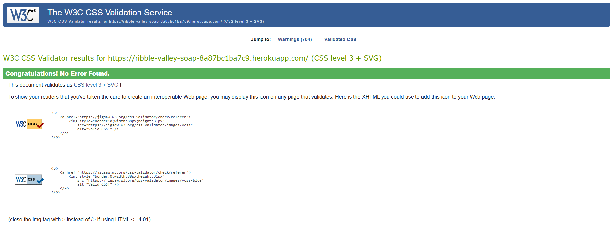

## Python

I have used the [PEP8 CI Python Linter](https://pep8ci.herokuapp.com) to validate my Python files.

- [Settings app PEP8 validation](documentation/testing/pep8/rbs-pep8-validation-settings.pdf)
- [Home app PEP8 validation](documentation/testing/pep8/rbs-pep8-validation-home.pdf)
- [Products app PEP8 validation](documentation/testing/pep8/rbs-pep8-validation-products.pdf)
- [Bag app PEP8 validation](documentation/testing/pep8/rbs-pep8-validation-bag.pdf)
- [Checkout app PEP8 validation](documentation/testing/pep8/rbs-pep8-validation-checkout.pdf)
- [Profile app PEP8 validation](documentation/testing/pep8/rbs-pep8-validation-profiles.pdf)

## JS 

I used the tool [JShint](https://jshint.com/) to validate my js code.

- JS linked with the Stripe Elements.

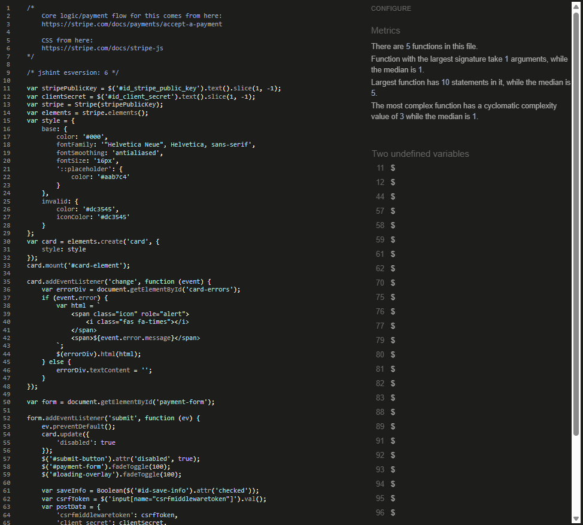
- An update button to alter product quantity in bag.

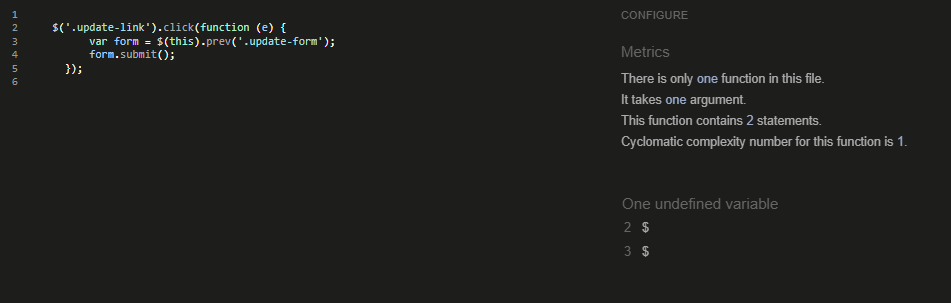
-  JS for the product image gallery on the product detail page

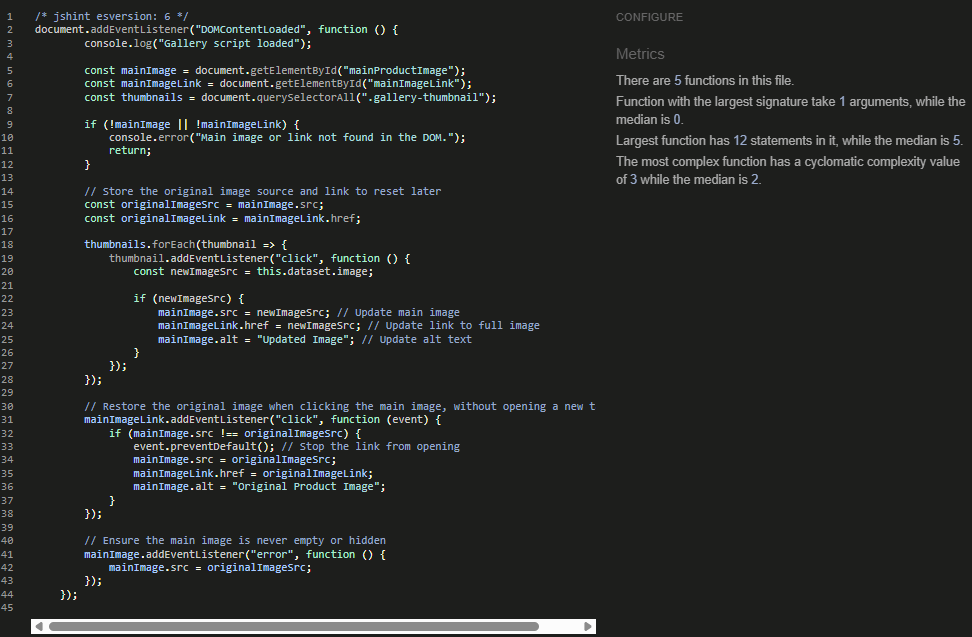
- JS for back to top button and toast timeout functions

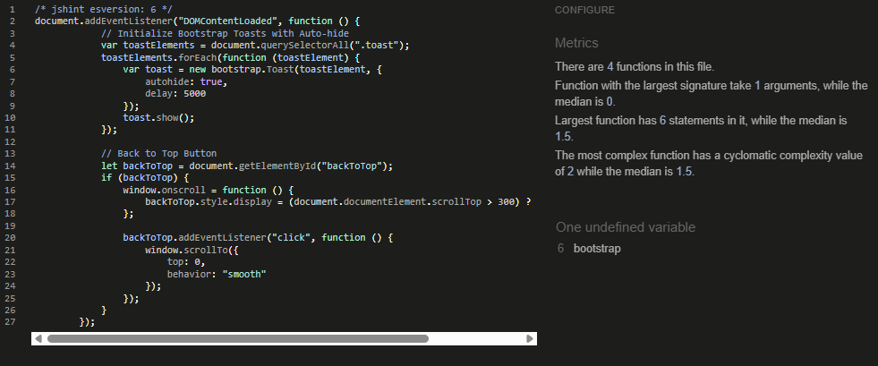

- JS for the quantity selectors

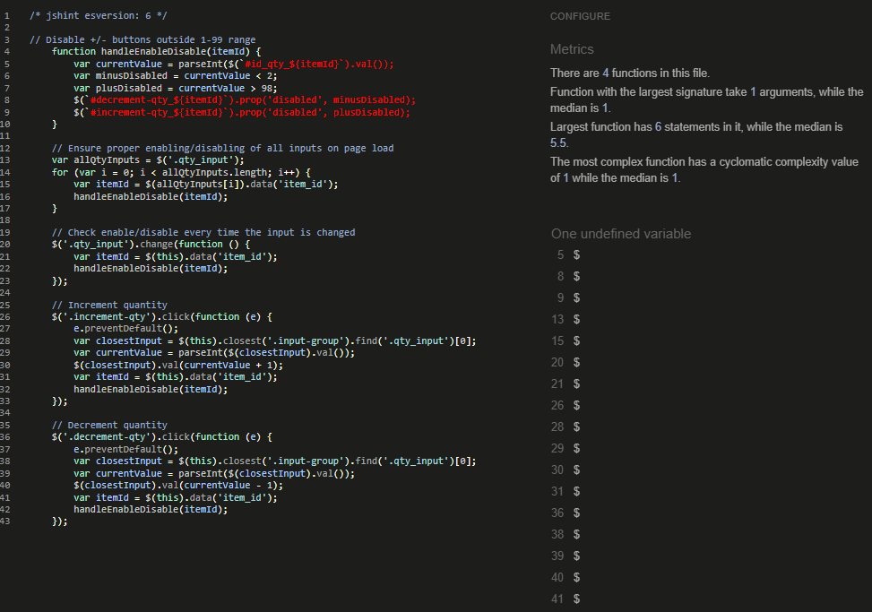

## Browser Compatability

I have tested my site on different browsers to check for any compatability issues.

| Browser | Screenshot | Notes |
| --- | --- | --- |
| Chrome | 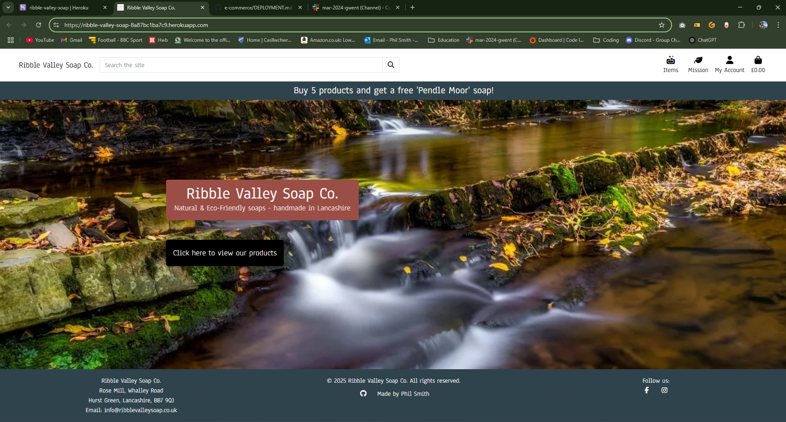 | Works as expected |
| Edge | 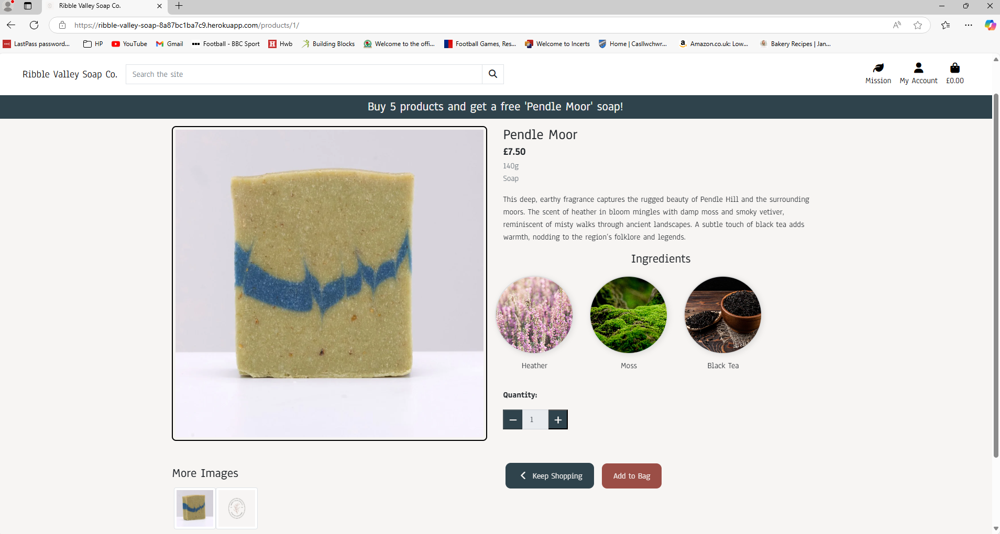 | Works as expected |
| Brave | 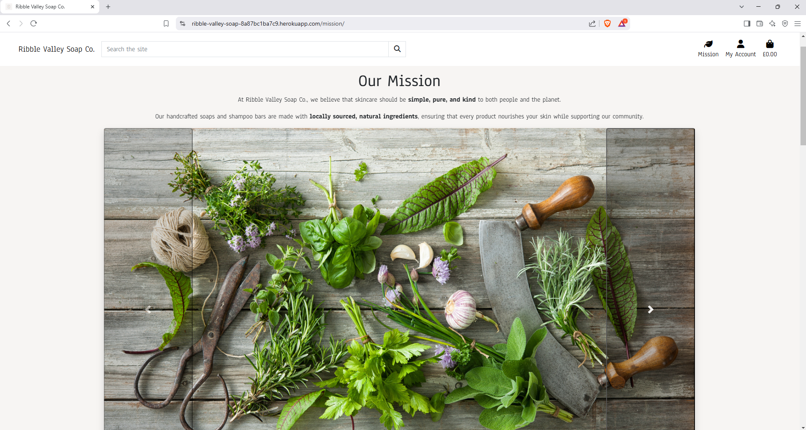 | Works as expected |
| Firefox | 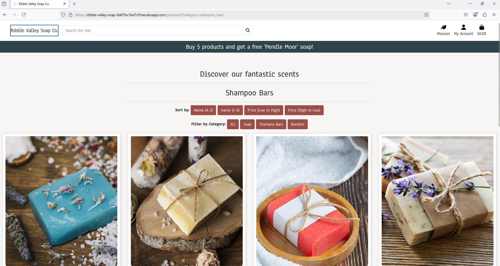 | Works as expected |

## Responsiveness

I have tested my site on different devices and screen sizes to check for any responsiveness problems. I used a combination of devtools and [responsive viewer](https://responsiveviewer.org/) to ensure that the site works effectively on multiple mobiles and tablets. 

- [Mobile Responsive Report](documentation/testing/responsive/responsive-design-report.pdf)
- [Tablet Responsive Report](documentation/testing/responsive/responsive-design-report-tablet.pdf)

## Lighthouse

I've tested my deployed project using the Lighthouse tool to check for issues.

There are warnings in my deployed site and many of these were issues with cookies. Due to time restraints I did not have enough time to spend on this aspect to remedy it.

- [Lighthouse Report](documentation/testing/lighthouse/rbs-lighthouse-report.pdf)

## Manual Testing

I have thoroughly tested each aspect of the website as shown below.

| Page | User Action | Expected Result | Pass/Fail | Comments |
| --- | --- | --- | --- | --- |
| Navbar | | | | |
| | Click on title in navbar | Redirection to Home page | Pass | |
| | Search for item | Redirection to a results page | Pass | |
| | Search for item | Shows results if there is one | Pass | |
| | Search for item | Shows a no results found page | Pass | |
| | Click on Items (if logged in) | Dropdown appears | Pass | |
| | Click on All Products (in Items) | Redirection to All Products page | Pass | |
| | Click on Soaps (in Items) | Redirection to Soap page | Pass | |
| | Click on Shampoo Bars (in Items) | Redirection to Shampoo Bars page | Pass | |
| | Click on Bundles (in Items) | Redirection to Bundles page | Pass | |
| | Click on Mission | Redirection to Mission page | Pass | |
| | Click on My Account | Dropdown appears | Pass | |
| | Click on Product Management (if superuser, in My Account) | Redirection to Add Product page | Pass | |
| | Click on My Profile (in My Account) | Redirection to My Profile page | Pass | |
| | Click on Logout (in My Account) | Takes you to Logout page | Pass | |
| | Click on Bag icon | Takes you to Bag page | Pass | |
| | Click on My Account (if logged out) | Dropdown appears | Pass | |
| | Click on Register (in My Account) | Takes you to Register page | Pass | |
| | Click on Login (in My Account) | Takes you to Login page | Pass | |
| Index | | | | |
| | Click on Button under title | Takes you to Products page | Pass | |
| Footer | | | | |
| | Click on Github logo | Takes you to Github | Pass | |
| | Click on Facebook logo | Takes you to Facebook | Pass | |
| | Click on Instagram logo | Takes you to Instagram | Pass | |
| Mission | | | | |
| | Click on next button in carousel | Takes you to the next image | Pass | |
| | Click on previous button in carousel | Takes you to the previous image | Pass | |
| | Click on button 'Shop our Products' | Takes you to Products page | Pass | |
| Products Page | | | | |
| | Click on Sort by Name(A-Z) | Displays products from A-Z | Pass | |
| | Click on Sort by Name(Z-A) | Displays products from Z-A | Pass | |
| | Click on Sort by Price (Low to High) | Displays products from cheapest to most expensive | Pass | |
| | Click on Sort by Price (High to Low) | Displays products from most expensive to cheapest| Pass | |
| | Click on Filter by All | Displays products all products | Pass | |
| | Click on Filter by Soap  | Displays only soaps | Pass | |
| | Click on Filter by Shampoo Bars  | Displays only shampoo bars | Pass | |
| | Click on Filter by Bundles  | Displays only bundles | Pass | |
| | Click on Back to Top button  | Takes user to top of page | Pass | |
| | Click on Edit product (if superuser) | Takes user edit product page | Pass | |
| | Click on Delete product (if superuser)  | Deletes the product | Pass | A toast message pops stating item has been successfully deleted |
| Products Detail | | | | |
| | Click on increase quantity button  | Adds a product to the input form | Pass | |
| | Click on decrease quantity button  | Decreases number in input form | Pass | Unless number is already a 1, cannot be a negative number |
| | Click on Edit product (if superuser) | Takes user to edit product page | Pass | |
| | Click on Delete product (if superuser)  | Deletes the product | Pass | |
| | Click on Keep Shopping button | Takes user to products page | Pass | |
| | Click on Add to bag button  | Adds whatever quantity is in input form to bag | Pass | A success toast appears to inform user |
| | Click on image in 'More Images' section | Displays that photo as main image | Pass | |
| | Click on main image | User is taken to a new tab that displays the image full screen | Pass | |
| Bag| | | | |
| | Click on Keep Shopping button | Takes user to products page | Pass | |
| | Click on increase quantity button  | Adds a product to the input form | Pass | |
| | Click on decrease quantity button  | Decreases number in input form | Pass | Unless number is already a 1, cannot be a negative number |
| | Click on remove button | That item is removed from the bag | Pass | |
| | Click on update button | Quantity of items updates to whatever is selected | Pass | |
| | If 5 or more items are put into bag | A free soap is gifted | Pass | A success toast message alerts user of their gift |
| | If 5 or more are in the bag and the total number of items drops below 5 | Free gift is removed from bag | Pass | A toast appears informing user the free gift is no longer in their bag |
| | Click on Checkout button | Takes user to Checkout page | Pass | |
| Checkout | | | | |
| | User fills out all fields marked with asterisks | Checkout can be completed | Pass | |
| | Any field not filled out that needs to be | A message appears informing user that checkout cannot be completed | Pass | |
| | Check 'save delivery details' | Updates the user profile in My Profile | Pass | |
| | Enters a correct card number, month/year, cvc and zip | Takes user to Checkout Success page | Pass | Loading spinner is launched and Stripe process payment |
| | Click on Complete Order | Activates payment and redirects to Checkout Success page | Pass | Checkout Success displays the order that has just been completed, email confirmation has been sent too |
| | Click on Adjust Bag | Redirects to bag page | Pass | |
| | Click on choose country field | Dropdown appears and user selects their country | Pass | |
| Checkout Success | | | | |
| | Click on Back to Products | Redirects to Products page | Pass | |
| Product Management | | | | |
| | Page only accessible if user is superuser | | Pass | |
| | Fill in form | If form is valid, a product is added to the database | Pass | Product can be made on the front-end |
| | All fields marked with an asterisk need to be filled | A warning message pops stating field needs to be filled in | Pass | |
| | Click on Add Product | adds product to database and product page | Pass | Redirects to that particular products page |
| | Click on Cancel button | Redirects to Products page | Pass | |
| Edit Product | | | | |
| | Page only accessible if user is superuser | | Pass | Alert toast informs user they are editing a product |
| | All fields are pre-filled with information from the database | | Pass |
| | Click on Update Product | Updates product in database | Pass | Redirects to that particular products page, success toast is activated |
| | Click on Cancel button | Redirects to Products page | Pass | |
| My Profile | | | | |
| | Clicking Update information button | Updates and saves users details | Pass | A success toast pop informing them of the saved changes |
| | Click on Delete My Account button | Redirects to Delete Account page | Pass | |
| | Click on any past order number | Redirects to a checkout success page | Pass | Details of that particular order are displayed and a toast informing the user that this is a past order appears |
| Delete Account | | | | |
| | Click on Yes Delete My Account button | Deletes account | Pass | |
| | Click on Cancel button | Redirects to My Profile page | Pass | |
| Login | | | | |
| | Click on Sign Up button | Redirects to Register page | Pass | |
| | Click on Home button | Redirects to Home page | Pass | |
| | Click on Sign In button | Redirects to Home page | Pass | If user credentials are valid |
| | Click on Forgot Password button | Redirects to Forget Password page | Pass | |
| | Check Remember Me button | User login and password are saved | Pass | |
| Logout | | | | |
| | Click on Sign Out button | Redirects to Home page | Pass | User is signed out toast appears |
| | Click on Cancel button | Redirects to Home page | Pass | |
| Register | | | | |
| | Click on Sign In button | Redirects to Login page | Pass | |
| | Click on Back to Login button | Redirects to Login page | Pass | |
| | Click on Sign Up button | If form is valid, user redirects to email confirmation page| Pass | |
| | Click on Sign Up button | User is asked to verify email address | Pass | |
| | User confirms and follows link in email | User is redirected to Home page | Pass | A success toast pops |

## User Stories

Each user story has been fulfilled.

| EPIC | User Story | Screenshot |
| --- | --- | --- |
| Viewing & Navigation |  |  |
|  | As a user I can view the items for sale, so I select an item to buy. | 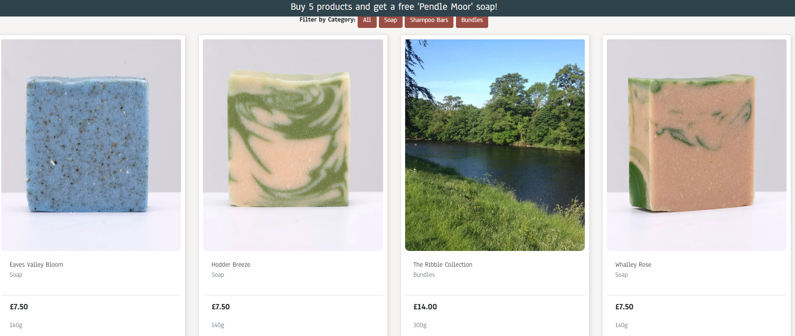 |
|  | As a user I can view items of the same type so I can find items I want efficiently. | 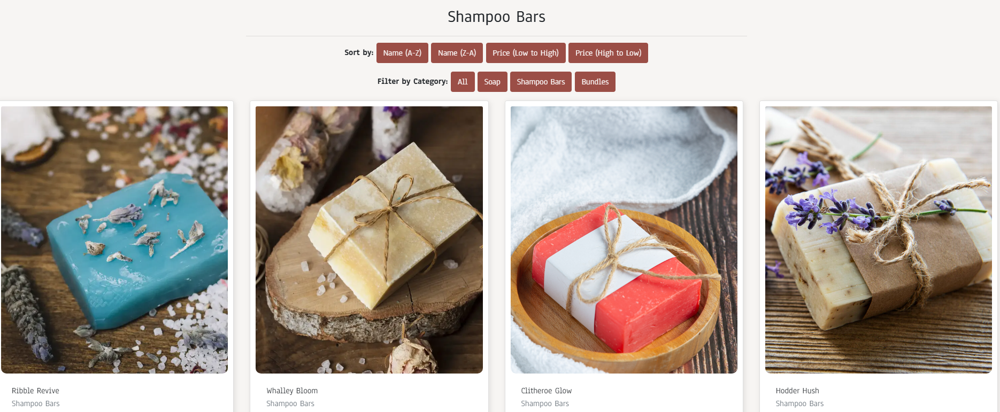 |
| | As a user I can view specific detailed information about an item, so I can learn about the price, description, smell and feel. | 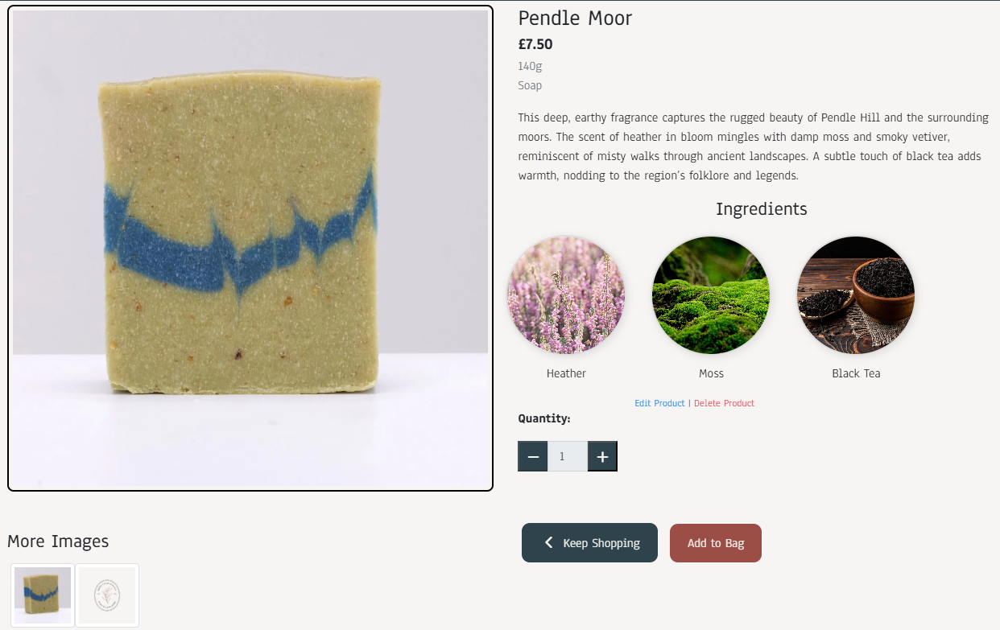 |
| | As a user I can view items that belong in a bundle, so I buy products at a discounted rate. | 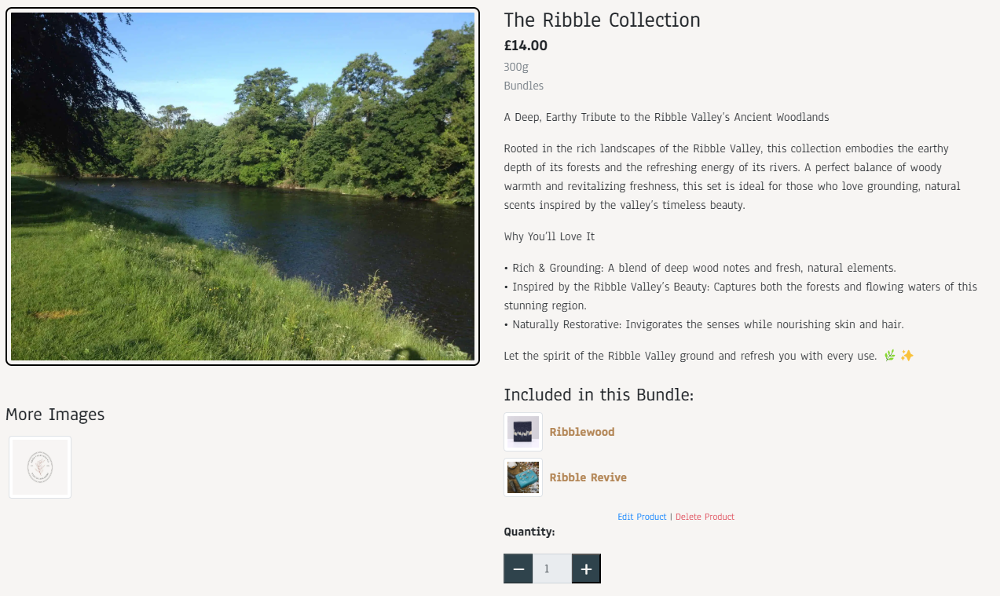 |
| Registration & User Accounts |  |  |
|  | As a user I can register for an account, so I can use the site and view my profile. | 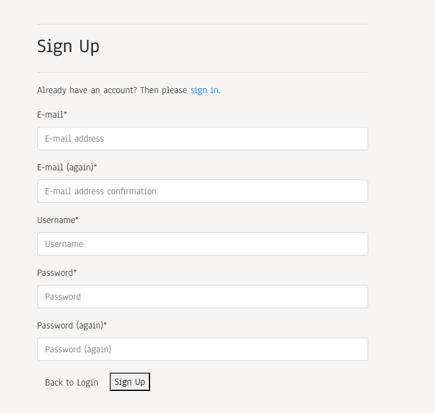 |
|  | As a user I can login and logout, so I can access my information and use the site. | 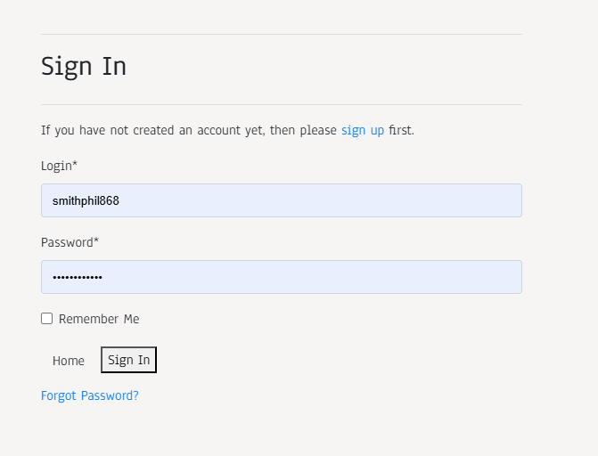 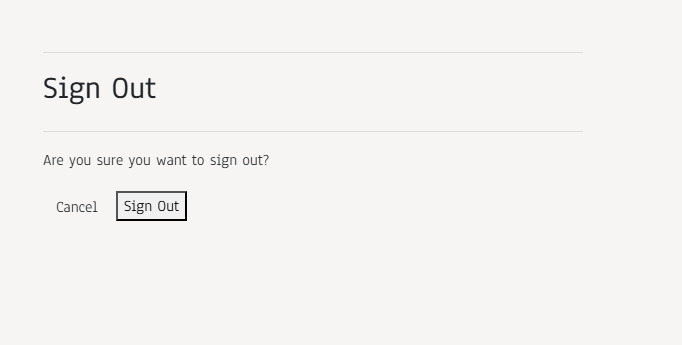 |
|  | As a user I can recover my password, so I can use my account if I forget/lose access to my account. | 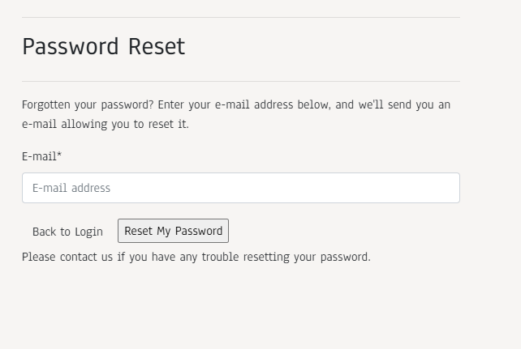 |
|  | As a user I can expect an email confirmation after registering, so I can verify my email address ensuring the safety of my account. | 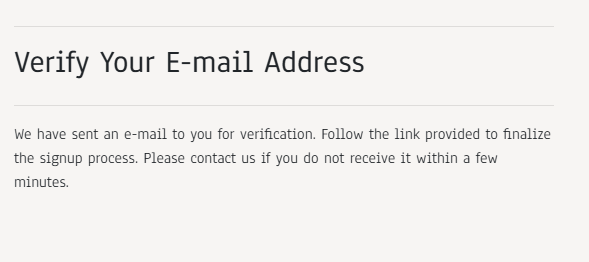 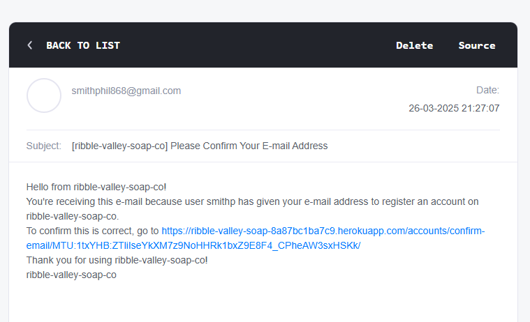 |
| Sorting and searching |  |  |
|  | As a user I can sort the list of products, so I can identify specific categories of products. | 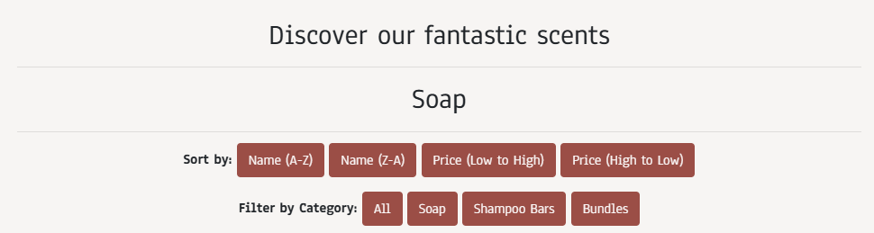 |
|  | As a user I can search for a specific item so I can find items easier. | 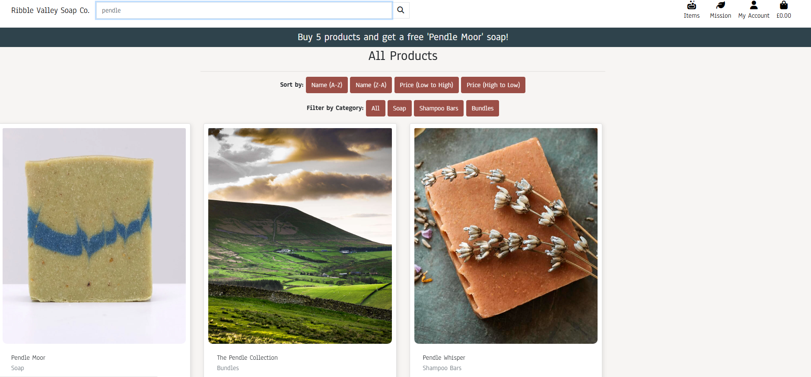 |
| Purchasing and Checkout |  |  |
|  | As a user I can select the quantity of a product, so my order is correct. | 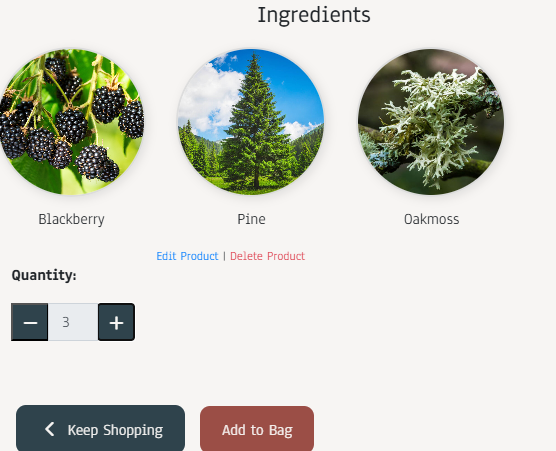 |
|  | As a user I can update/change items in the bag so I can make any final changes before purchasing. | 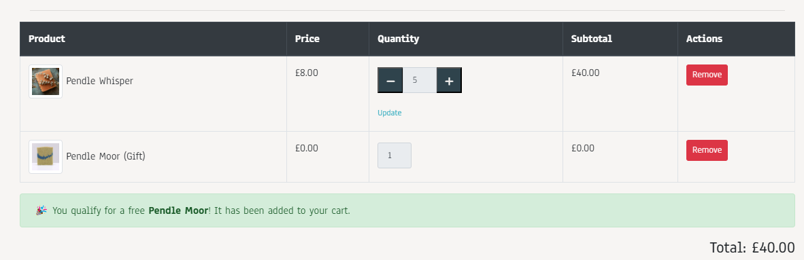 |
|  | As a user I can enter payment information so that I can checkout without any issues. | 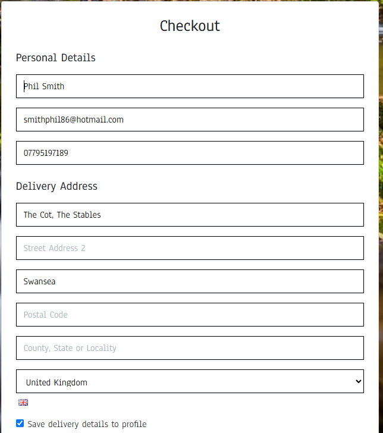 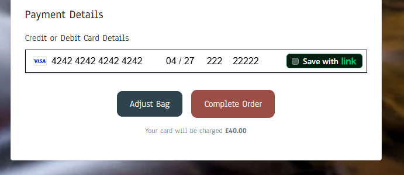 |
|  | As a user I know my details provided are safe and secure so I be confident about the purchase. | 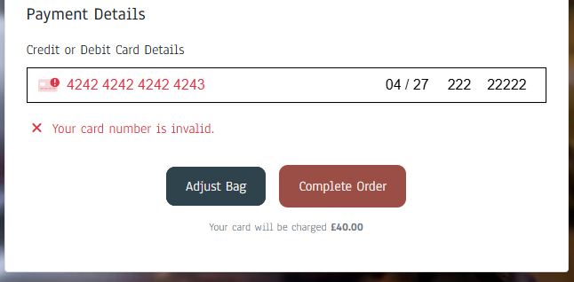 |
|  | As a user I can receive an order summary upon completion of an order so I can check to see if there any mistakes. | 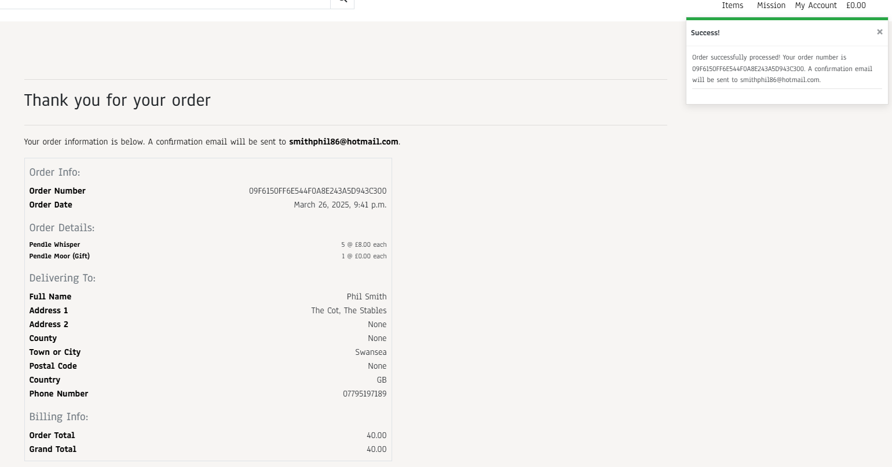 |
| Admin & Business Owner |  |  |
|  | As a site owner I can add items to product catalogue by using user-friendly front-end forms so I do not have to use the back-end admin panel. | 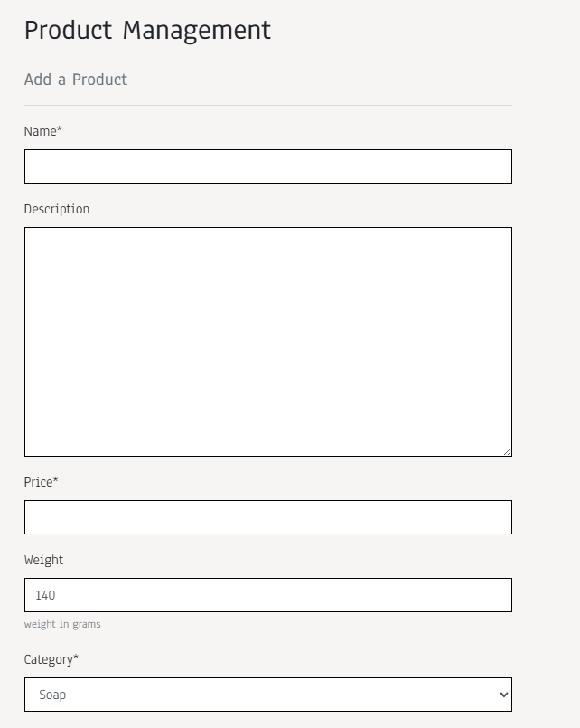  |
|  | As a site owner I can edit and update products so I know the products for sale are up to date. | 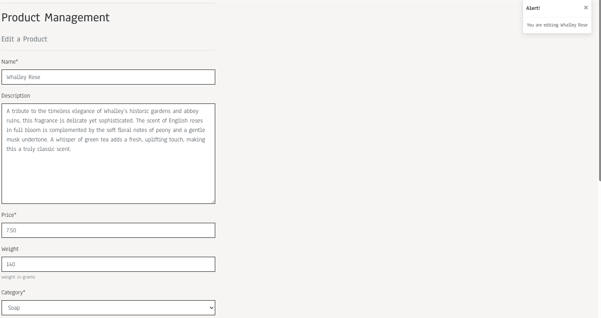 |
|  | As a site owner I can delete a product so my inventory of items is up to date. | 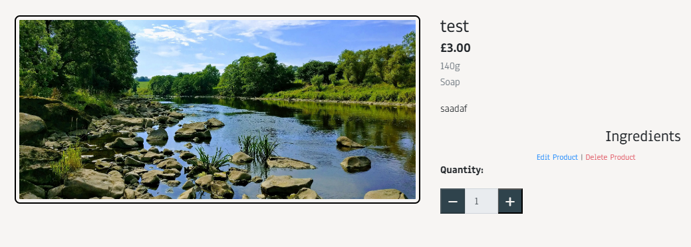 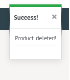 |
| Shopping Bag |  |  |
|  | As a user I can add items to the shopping bag so I can keep shopping until I am ready to pay. | 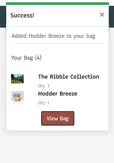 |
|  | As a user I can remove an item from the shopping bag so I can ensure that my order is accurate. |  |
|  | As a user I can see my current total, so I can keep track of my current spend. | 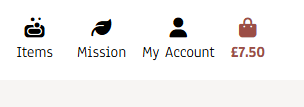 |
| User Profile App |  |  |
|  | As a user I can view and edit my profile so I can update information as and when needed. | 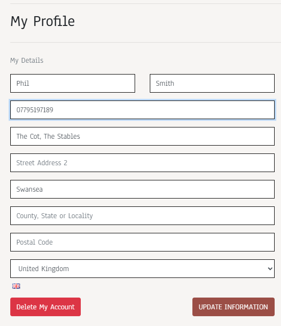 |
|  | As a site owner I can organise a database of user profiles, so profile can be created/updated to the back end of the site. | 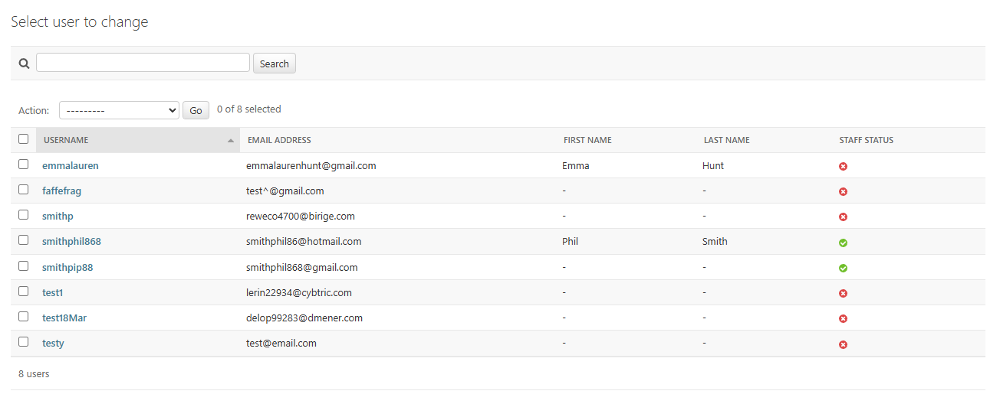 |

## README

Go back to the [README.md](README.md).